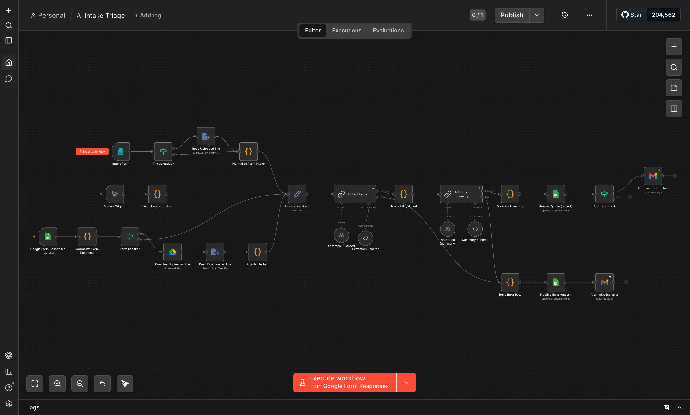
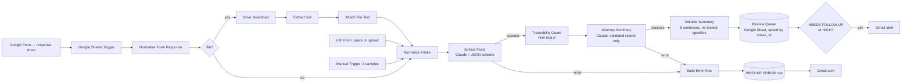

# AI Intake Triage — n8n + Claude

A working n8n workflow that turns messy intake (a rambling voicemail transcript, an incomplete web form, a referral e-mail with gaps) into a **structured, reviewable row** for a law firm's intake staff — with every extracted fact traceable to a verbatim quote, `NOT FOUND` where the source is silent, a five-sentence attorney summary, and an e-mail alert when a human needs to step in.

Built for the *AI Specialist* take-home (AI intake triage). Synthetic data only.



## What it does, in one paragraph

An intake arrives through one of three doors — a **Google Form** (what staff would use), an **n8n form** (paste or upload), or a **batch trigger** with the three sample intakes. Claude extracts the required fields, each paired with an exact quote from the source. A deterministic **Traceability Guard** then re-checks every quote against the original text and reverts anything that does not match to `NOT FOUND`. A second Claude call writes a five-sentence summary **from the validated record only**. A validator counts the sentences and checks that no phone number, e-mail or year in the summary is absent from the source. The result is upserted into the **Intake Review Queue** Google Sheet, and if the intake is incomplete (`NEEDS FOLLOW-UP`) or rated `HIGH` urgency, a Gmail alert goes to the staff inbox. If the AI step fails for any reason, the intake still gets a `PIPELINE ERROR` row with its original text and a separate alert — nothing is ever dropped silently.

## The four goals → where they are met

| Goal | Where | Evidence |
|---|---|---|
| **01 Structured extraction** — JSON per intake with client name, contact info, facility/provider, date of incident, injury type, referral source, urgency flag | `Extract Facts` (Basic LLM Chain + Anthropic + `Extraction Schema` parser). Schema: [`n8n/extraction-schema.json`](n8n/extraction-schema.json) | [`outputs/intake-1.json`](outputs/intake-1.json), `-2`, `-3` — the `record` object |
| **02 Attorney-ready summary** — five sentences | `Attorney Summary` chain + sentence count in `Validate Summary` | `summary` in the outputs; screenshot [`execution-intake3.jpeg`](screenshots/execution-intake3.jpeg) |
| **03 Traceability and honesty** — every fact traceable; `NOT FOUND`, never a guess; *show the rule* | **`Traceability Guard`** Code node — [`n8n/nodes/02-traceability-guard.js`](n8n/nodes/02-traceability-guard.js). The rule is code, not a prompt instruction. | Screenshot [`guard-node.jpeg`](screenshots/guard-node.jpeg); offline test [`scripts/test-guard.js`](scripts/test-guard.js) feeds a fabricated quote and asserts it is reverted |
| **04 Prove it fails safely** — run intake #3 | Intake #3 → `potential_client_name: NOT FOUND` → `NEEDS FOLLOW-UP` row + alert naming who can supply the gap. Bonus: a 6 MB "wrong attachment" that the API rejects → `PIPELINE ERROR` row + alert. | [`outputs/intake-3.json`](outputs/intake-3.json), [`outputs/intake-4-oversized.error-row.json`](outputs/intake-4-oversized.error-row.json), screenshots [`email-alert-needs-followup.jpeg`](screenshots/email-alert-needs-followup.jpeg), [`error-branch.jpeg`](screenshots/error-branch.jpeg), [`email-pipeline-error.jpeg`](screenshots/email-pipeline-error.jpeg) |

## Architecture



### The rule (Goal 03), in plain words

The prompt *asks* the model not to guess. The **Traceability Guard** *guarantees* it:

1. Every field the model returns is `{ value, evidence }`. `evidence` must be a quote copied character-for-character from the intake.
2. The guard normalises only case, quote style, dash style and whitespace — never letters or digits — and checks `source.includes(evidence)`. A paraphrase fails.
3. A fact whose quote is missing, too long to be a citation, or not found verbatim is **reverted to `NOT FOUND`** and logged in `warnings`. Nothing is "fixed up".
4. A normalised ISO date is only allowed when the quoted evidence itself contains a complete date with a year — *"right after Easter"* stays as words, and the human decides.
5. The summary writer never sees the raw intake: it receives the **validated record**, so it cannot reintroduce a fact the guard removed. A second validator then flags any phone number, e-mail or year in the summary that does not exist in the source.

What the rule does **not** do (stated honestly): it verifies *provenance*, not *inference*. `relationship_to_client: "referring attorney"` backed by the quote *"I'm referring a matter that's outside our practice area"* is a reasonable reading, but the guard only proves the quote exists — not that the label follows from it. That is the human reviewer's job, and the one-pager says so.

## Design decisions and tradeoffs

**Deterministic checks around a probabilistic model.** The LLM does what LLMs are good at (reading messy text); everything that must be *guaranteed* — provenance, sentence count, routing, error handling — is plain JavaScript in Code nodes with offline tests (`node scripts/test-guard.js`, 14 checks, no API calls).

**Two model calls instead of one.** Extraction must be literal and conservative; the summary must be fluent. Splitting them lets the guard sit in between. Cost: one extra call (~$0.004 per intake on Sonnet 5).

**Strict verbatim matching → occasional false `NOT FOUND`.** When the model paraphrases a quote, a real fact gets dropped and the intake goes to a human. I chose this on purpose: for a legal intake, an extra phone call is far cheaper than an invented fact reaching an attorney. Every guard decision is visible in the `warnings` column.

**Fail loud, keep the original.** Both LLM nodes route errors to a branch that writes a `PIPELINE ERROR` row with the source text and e-mails staff. Testing that branch with a 6 MB file revealed that the error row itself could fail (Google Sheets caps a cell at 50,000 characters) — a silent failure in the reporting path is the worst kind, so `source_text` is now truncated with a visible note.

**Routing by key, not by position.** n8n's LLM chain nodes do not preserve item pairing on successful outputs, so a downstream node cannot ask "which input produced this?". The model echoes an `intake_id` we place at the top of its message and the guard looks the source up by that key — with deterministic fallbacks (a single-intake run is unambiguous; positions are trusted only when no item was lost upstream; anything else stops the run with an explicit error).

**Google Form as the staff entry point.** Familiar, mobile-friendly, keeps every submission in a sheet, and does not expose n8n to the internet — at the price of up to one minute of polling latency and a Google sign-in for file uploads. The n8n form remains as the zero-setup alternative.

## Things that broke, and what they taught me

| What happened | Cause | Fix |
|---|---|---|
| Every intake went to the error branch with HTTP 400 | I had set `temperature: 0`; Claude Sonnet 5 / Opus 5 reject sampling parameters | Removed the option; the error branch caught it — first proof the safety net works |
| `Paired item data unavailable` in the guard | n8n LLM chains emit successful items without `pairedItem` | Key-based routing (above) |
| Model output rejected by the schema | Every field was `{value, evidence}` except `intake_id` (a string); the model "regularised" the exception and even marked it `NOT FOUND` | Removed the exception: `intake_id` is now `{value}` too, plus fallbacks |
| Summary counted as 7 sentences | `Marcus T. Bellweather` — the initial's period | Initials and titles are masked before counting |
| E-mail flagged as "not in source" | Regex captured the sentence's trailing period | Strip trailing punctuation |
| Alert e-mail arrived with empty fields | n8n's *Extract From File* drops the incoming JSON unless *Keep Source* is **explicitly** added (the UI default is misleading) | Option set in the export, and the next Code node re-reads the fields from the originating node |
| 6 MB intake broke the **error** row | Google Sheets cell limit | Truncate `source_text` with a visible marker |
| Haiku 4.5 produced malformed JSON (a stray `}`) | Smaller model losing track of nesting | Kept Sonnet 5; noted below |

A pattern worth naming: three times an n8n "default" was not what it looked like (`temperature`, `pairedItem`, `keepSource`). Each was found because the failure path was designed to be visible.

## Model choice and cost

| Model | Per intake (2 calls, measured ~2.1k in / 0.6k out for extraction) | Result |
|---|---|---|
| Claude Haiku 4.5 | ≈ $0.007 | Rejected — malformed JSON on the nested schema |
| **Claude Sonnet 5** (deliverable) | **≈ $0.014** | All samples correct, `warnings: none` |
| Claude Opus 5 | ≈ $0.036 | Drop-in: change the model ID in the two Anthropic nodes (`MODEL=claude-opus-5 node scripts/build-workflow.js`) |

At 500 intakes a month Sonnet 5 costs about $7. Every run in this repository (`outputs/`, screenshots, e-mails) was produced with Sonnet 5.

## What the paralegal sees

- **Google Form** — [`screenshots/google-form.jpeg`](screenshots/google-form.jpeg): channel, paste text or upload a file, your name.
- **Intake Review Queue** — [`screenshots/sheet.jpeg`](screenshots/sheet.jpeg): 21 columns ordered the way staff read them (status → urgency → client → summary → gaps → contact → context → technical trail), colour-coded by status; technical columns grouped at the far right.
- **E-mail alerts** — only when a human is needed: `NEEDS FOLLOW-UP`, `HIGH URGENCY`, `PIPELINE ERROR`.
- The **one-page enablement doc** for staff: [`docs/enablement-one-pager.md`](docs/enablement-one-pager.md).

## Run it yourself

Prerequisites: Docker, an Anthropic API key, a Google account.

```bash
cp .env.example .env            # set N8N_ENCRYPTION_KEY, GENERIC_TIMEZONE, ALERT_EMAIL
docker compose up -d            # n8n at http://localhost:5678 (create the owner account on first open)
```

1. **Import** `workflow/intake-triage.n8n.json` (Workflows → Create → Import from file).
2. **Credentials**: Anthropic (2 nodes); Google Sheets OAuth2 (2 nodes); Gmail OAuth2 (2 nodes); Google Sheets Trigger OAuth2 and Google Drive OAuth2 (Google Form branch). One Google Cloud OAuth client serves all four Google credential types (enable the Sheets, Drive and Gmail APIs; redirect URI `http://localhost:5678/rest/oauth2-credential/callback`).
3. **Review sheet**: create a Google Sheet, paste the single line of `n8n/sheet-headers.csv` into `A1`, select it in `Review Queue (upsert)` and `Pipeline Error (upsert)` with *Column to match on* = `intake_id` and *Handling extra data* = *Ignore it*. Optional conditional formatting: `=$A2="PIPELINE ERROR"` red, `=$A2="NEEDS FOLLOW-UP"` amber, `=$A2="READY FOR ATTORNEY REVIEW"` green, `=$B2="HIGH"` bold red.
4. **Google Form** (optional): questions titled `Channel` (dropdown: voicemail / web_form / referral_email / other), `Intake text`, `Your name`, `Intake file` (file upload); link responses to a sheet and select that sheet in `Google Form Responses`. Activate the workflow to poll it every minute.
5. **Run**: *Execute workflow* → Manual Trigger processes the three samples; the forms process one intake at a time.
6. **Fail-safe demo**: `node scripts/make-oversized-sample.js` → upload `samples/intake-4-oversized.txt` through a form.

Offline checks (no n8n, no API): `node scripts/test-guard.js`. Rebuild the export after editing prompts, schema or Code nodes: `node scripts/build-workflow.js`. Compare a UI export with the generated one: `node scripts/diff-export.js <download.json>`.

## Repository map

```
workflow/intake-triage.n8n.json   ← the export (generated; no credentials, no instance ids)
workflow/snippets/                ← paste-able branches (n8n form, Google Form)
prompts/                          ← the two system prompts + notes
n8n/extraction-schema.json        ← JSON schema the model must follow ({value, evidence} per field)
n8n/summary-schema.json           ← schema for the summary call
n8n/nodes/*.js                    ← the Code nodes (the guard lives in 02-traceability-guard.js)
n8n/sheet-headers.csv             ← header row of the review sheet
samples/                          ← the three synthetic intakes (+ generator for the oversized one)
outputs/                          ← real rows produced by the workflow
screenshots/                      ← canvas, guard, execution, sheet, form, e-mails
scripts/                          ← build-workflow, test-guard, diff-export, make-oversized-sample
docs/                             ← enablement one-pager (md, html, pdf)
docker-compose.yml, .env.example  ← reproducible n8n
```

## Known limitations and next steps

- **Urgency is a suggestion.** It is model judgement with a supporting quote; across runs intake #3 was rated MEDIUM where a lawyer might say HIGH. Staff are told to treat it as a prompt to look, never as a decision.
- **Provenance ≠ inference** (see *The rule*). A value can be a reasonable reading of a verified quote rather than a literal copy.
- **Summary may use context from verified quotes** (e.g. the street a facility is on). It is traceable, but a stricter variant would pass values only.
- **No retry on malformed model output.** The parser's *Auto-Fix* is off so the error path stays visible; in production I would enable one retry before escalating.
- **No size guard before the model.** The oversized file is rejected by the API (free), but a production version should cap `raw_text` before calling the model.
- **Re-processing re-alerts.** The sheet is deduplicated by `intake_id`; alerts are not.
- Not built: Drive/e-mail ingestion triggers, case-system write-back, PII redaction, multi-language intakes.

## Time log

| Phase | Time |
|---|---|
| Reading the brief, plan, environment (Docker, n8n, credentials) | ~1 h |
| Build: samples, prompts, schema, guard, validators, sheet, alerts | ~2 h |
| Iteration after real runs (the table above), Google Form branch, paralegal-first sheet | ~3 h |
| Documentation, screenshots, Loom | ~1.5 h |

The 90-minute figure in the brief was treated as the budget for the core build (samples → extraction → guard → summary → sheet), which is roughly what it took; the rest is the iteration a real deployment would need anyway, and I preferred to show it than to hide it.

## Tooling

n8n 2.16 (self-hosted, Docker) · Claude Sonnet 5 via the Anthropic API · Google Sheets, Drive, Gmail, Forms · Node 20 for the offline tests. I used Claude (Claude Code) as a pair-programmer for the Code nodes, tests and documentation; every node, prompt and decision in this repository was run, verified and reviewed by me.
